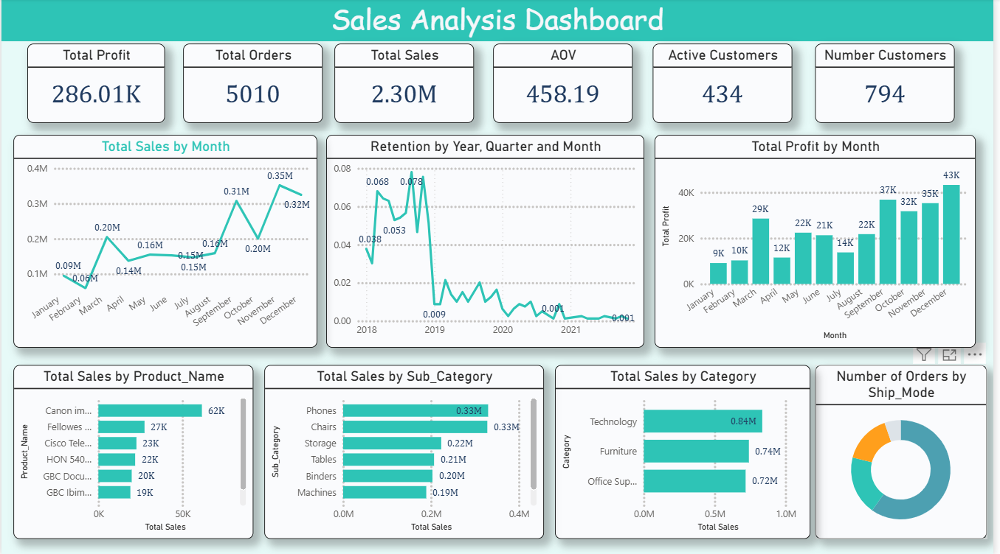
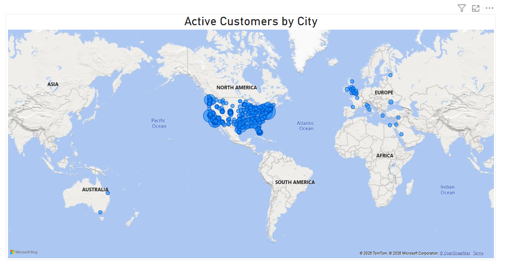

# E-Commerce-Marketplace-Analysis-

In this project, I analyzed an online marketplace dataset to uncover key business insights and performance gaps using SQL and Power BI.

The dataset contains order-level transactional data including:

Customer information (ID, Segment, City, Region)
Order details (Order Date, Product, Category)
Sales metrics (Sales, Profit, Discount, Quantity)

Tools Used:

SQL |Power BI |Data Cleaning |DAX |Data Visualization

What I did:

Performed data cleaning and validation (missing values, duplicates, inconsistencies)

Built customer status flags (Active, New, Repeat, Churned)

Calculated key KPIs:

Active Customers (Monthly)

Churn Rate & Retention Rate

Average Order Value (AOV)

Customer Lifetime Value (LTV)

Conducted Product & Category performance analysis

Built interactive dashboards in Power BI
Key Insights:

Identified top-performing products and categories

Detected churn patterns and retention opportunities

Highlighted regional sales performance differences

Analyzed profitability trends over time.

 Dashboards

1. Sales Overview

2.  Map

